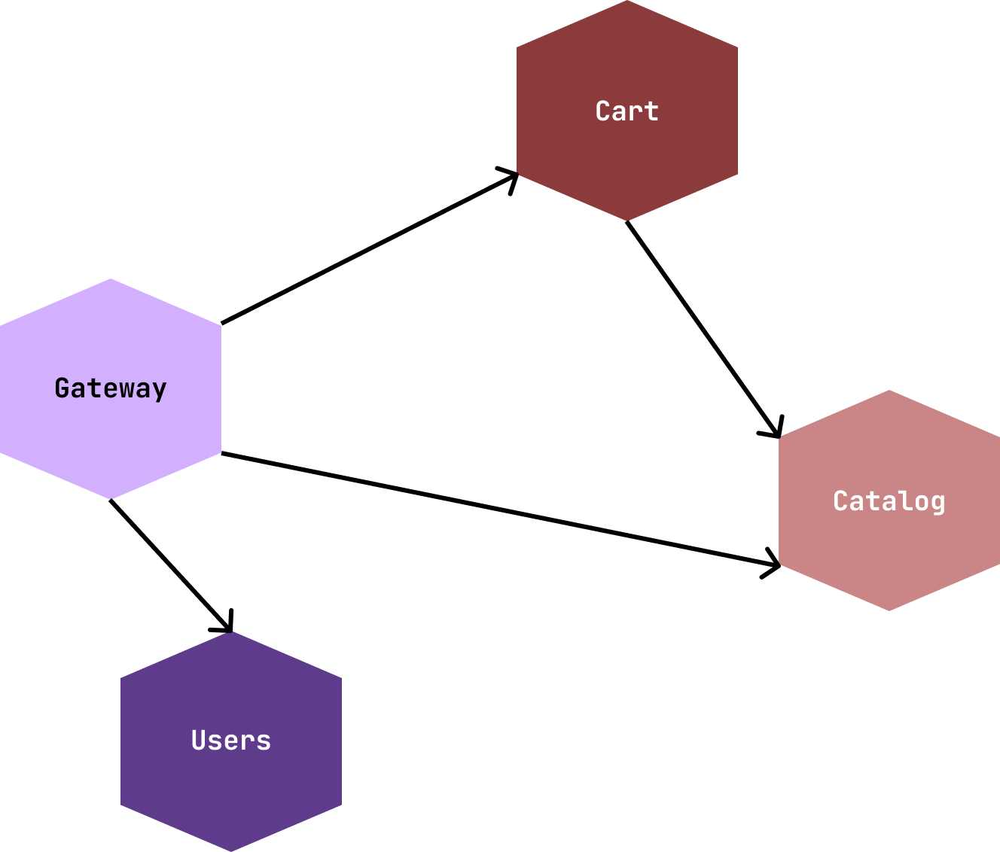

# Project Structure Overview



# Goals

To learn how to properly refactor to reactive

# Step 1. From Bottom to Top

The goal of this step is to demonstrate how to start refactoring of the existing Microservices
System in the way you will not break the whole system by introducing Reactive Programming concept
with Project Reactor and WebFlux

The very first step you should start with is adding the

```groovy
    implementation 'org.springframework.boot:spring-boot-starter-webflux'
```

dependency in all the places you have web module. This will keep WebMVC module as a priority one but
will add support for Reactive Types
and [`WebClient`](https://docs.spring.io/spring-framework/docs/current/reference/html/web-reactive.html#webflux-client)

## 1.1 Rework AuthenticationClient in the GatewayService

Modify `HttpAuthenticationService` to use `WebClient`

> ***Remember***. The API should remain imperative on this Step.
> Use method `.block()` to convert Reactive to Imperative

Run `ServiceIntegrationTest` to ensure functionality has not been broken during the modification

## 1.2 Add similar Authentication Request Customizer for `WebClient`

At the moment we have `delivery.app.common.security.web.client.JWTHeadersClientRequestCustomizer`
responsible for adding `Authorization: Bearer ...` header to a request. If we replace `RestTemplate`
, we need to make sure `WebClient` offers same functionality. For that purpose
use [`org.springframework.web.reactive.function.client.ExchangeFilterFunction`](https://docs.spring.io/spring-framework/docs/current/reference/html/web-reactive.html#webflux-client-filter)
which is a new intercepting mechanism for `WebClient` and implement same logic was before.

> ***Note***: in new Reactive Web networking `ClientRequest` is an immutable entity.
> Use `ClientRequest.from(origin)....build()` to modify it in `ExchengeFilterFunction`.


Finally, modify the `BaseConfiguration` class, and define a `WebClientCustomizer` bean to introduce
created `ExchengeFilterFunction`.

## 1.3 Start from simple. Rework `HttpCatalogService` in CartService

The simples Http integration which uses Auth functionality is in `CartService` rework it
to `WebClient` support.

> ***Remember***. The API should remain imperative on this Step.
> Use method `.block()` to convert Reactive to Imperative

## 1.4 Rework UserService to use `ReactiveCrudRepository` with R2DBC

Add [R2dbc](https://docs.spring.io/spring-framework/docs/current/reference/html/data-access.html#r2dbc)
support by replacing

```groovy
implementation 'org.springframework.boot:spring-boot-starter-data-jdbc'
```

with

```groovy
implementation 'org.springframework.boot:spring-boot-starter-data-r2dbc'
implementation("io.r2dbc:r2dbc-h2")
```

Also, make sure your are modifying `application.yaml` and adding replacing old datasource config:

```yaml
spring:
  datasource:
    url: jdbc:h2:file:./build/data/usersdb
    driverClassName: org.h2.Driver
    username: sa
    password: password
```

with a new one:

```yaml
spring:
  r2dbc:
    url: r2dbc:h2:file:///./build/data/usersdb
    username: sa
    password: password
```

> ***Remember***. The API should remain imperative on this Step.
> Use method `.block()` to convert Reactive to Imperative

# Step 2. To WebFlux where it is needed!

At this step we will refactor completely to WebFlux but at the places where it is really needed!

## Step 2.1 Refactor Gateway to WebFlux

1. Remove WebMVC dependency from the service
   > ***Note***: module `commons` may still bring an old WebMVC dependency.
   > Exclude it from `gateway-service/build.gradle` using 
   >  ```gradle
   >    configurations.implementation  {
   >       exclude group: 'org.springframework.boot', module: 'spring-boot-starter-web'
   >    } 
   >  ```
2. Rework Security Configuration to Support WebFlux Security. Replace the old `SecurityConfig` with
   the following one
    ```java
    
    @EnableWebFluxSecurity
    public class SecurityConfig {
    
      @Bean
      SecurityWebFilterChain springSecurityFilterChain(ServerHttpSecurity http) {
        http
            .authorizeExchange((exchanges) ->
                exchanges
                    .pathMatchers("/login").permitAll()
                    .pathMatchers("/css/**", "/index").permitAll()
                    .pathMatchers(HttpMethod.GET, "/api/products", "/api/products/*").permitAll()
                    .anyExchange().authenticated()
            )
            .formLogin((formLogin) ->
                formLogin
                    .loginPage("/login")
            );
        return http.build();
      }
    }
    ```
3. Rebase `RemoteAuthenticationManger` to extend `ReactiveAuthenticationManager`
4. Migrate `RoutingController` to use Reactive Types from end to end. Use `DataBuffer` class instead
   of `Resource`
   ```java
      public Mono<ResponseEntity<Flux<DataBuffer>>> handle(
          @PathVariable("service") String service, 
          @Nullable @PathVariable(value = "path", required = false) String path,
          HttpEntity<Flux<DataBuffer>> httpEntity, 
          HttpMethod httpMethod
      ) {
        // new impl
      }
   ```


     